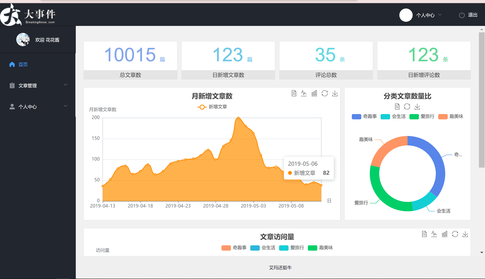
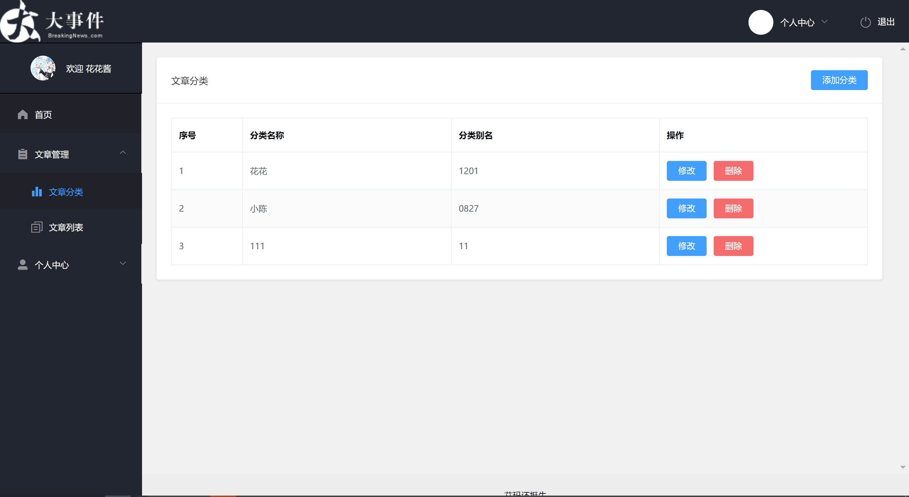
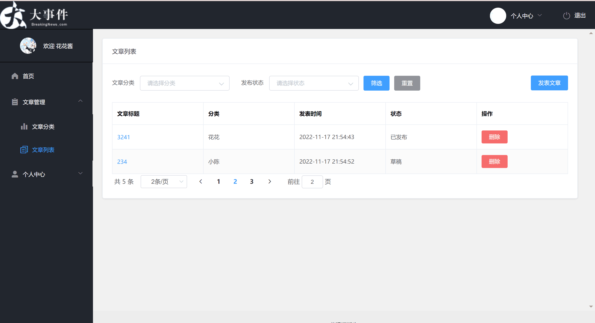
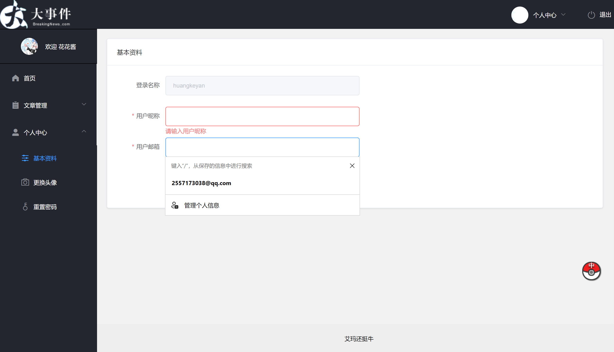
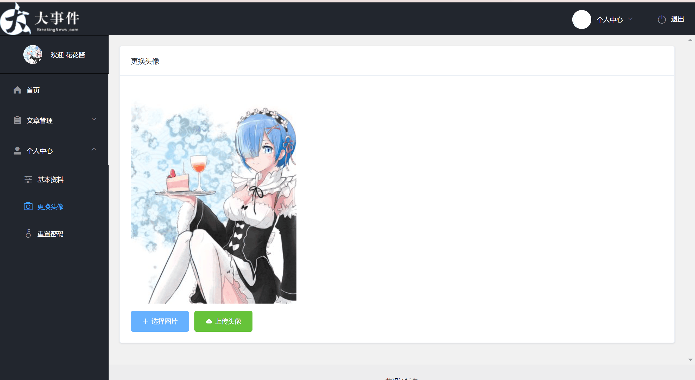

# vue-event

## 下载组件
```
npm install
```

### 运行
```
npm run serve
```

### 打包
```
npm run build
```

###  技术栈
```
vue-cli (自定义配置vue2脚手架)

Less (css预处理语言)

axios  (网络请求库)

axios请求拦截器 (在发起时，统一携带请求头Authorization和token值,登录和注册页面除外)

axios响应拦截器 (token过期时 清空vuex中存储的数据 导致被动退出)

elementUI (组件库)
 
echarts   (图表  各种饼状图 柱状图 线性图)

vue-router vuex   (vue相关生态路由 以及vuex公共状态管理)

vue-quill-editor  (富文本编辑器 用于发表文章)    

```
###  演示图：








### Customize configuration
See [Configuration Reference](https://cli.vuejs.org/config/).
